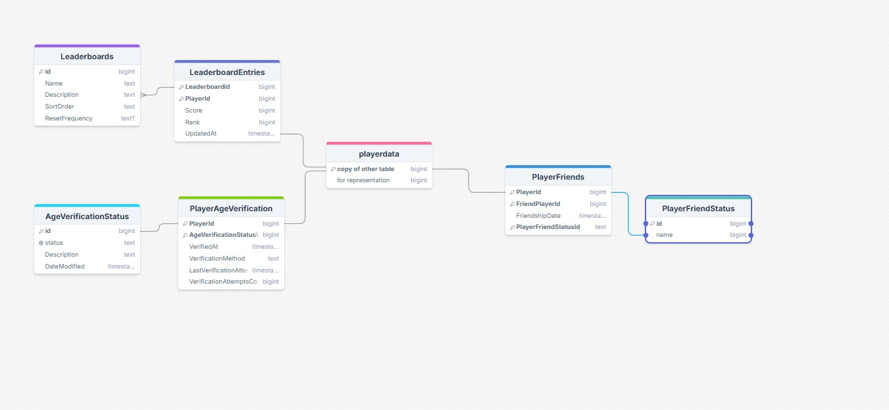

# Cookie Clicker API (api-cookie)

[![Issues][issues-shield]][issues-url]
[![Forks][forks-shield]][forks-url]
[![Stargazers][stars-shield]][stars-url]
[![MIT License][license-shield]][license-url]

## Overview

This repository contains the backend API server for the Cookie Clicker Unity game. It provides essential services for player authentication, game state persistence, chat integration (via Firebase Realtime Database), and leaderboards.

**Major Recent Accomplishments (April 18th, 2024):**

*   **Transition from Local Saves:** The game has been significantly refactored. Previously, player data was stored locally using encrypted files. This backend API now serves as the central **source of truth** for all persistent player data, enabling cross-device play (via Firebase Auth) and server-authoritative features.
*   **Firebase Authentication Integration:** Implemented player identification using Firebase Anonymous Authentication. New users are registered, and existing users (identified by Device ID) are linked to their Firebase UID upon first login after the update.
*   **Server-Side Game State:** The API now handles loading and saving the complete game state, including score, upgrades, prestige, settings, offline progression time, etc.
*   **Leaderboards:** Added a new endpoint to provide ranked leaderboard data based on player lifetime score and prestige count.
*   **Chat Integration Support:** While chat messages are primarily handled via Firebase Realtime Database, the player identification system ensures messages can be associated with the correct authenticated player UID.

## Features

*   **Player Identification & Authentication:**
    *   `POST /api/players/identify`: Handles player login/registration. Takes `DeviceId` and `FirebaseUid`. Finds player by UID, links existing DeviceID to UID if found, or creates a new player record. Returns basic `PlayerDto`.
*   **Game State Management:**
    *   `GET /api/players/{playerId}/gameState`: Retrieves the full game state for a given player ID.
    *   `PUT /api/players/{playerId}/gameState`: Saves the full game state received from the client.
*   **Leaderboards:**
    *   `GET /api/leaderboards/top`: Returns a ranked list (top 50) of players based on `TotalLifeTimeScoreEarned` (descending) and `PrestigeCount` (descending as tie-breaker).
*   **Other Player Operations:** Includes endpoints for getting basic player info, deleting players (primarily for testing), updating chat usernames, and managing muted players.

## Technology Stack

*   **Framework:** .NET 9.0 / ASP.NET Core
*   **Database:** PostgreSQL
*   **ORM:** Entity Framework Core 9.0 with Npgsql provider
*   **API Documentation:** Swagger / OpenAPI (via Swashbuckle)
*   **Authentication:** Relies on Firebase Authentication (client-side) for UID generation.

*(See `Api.csproj` for specific package versions)*

## Setup & Running

1.  **Prerequisites:**
    *   .NET 9 SDK
    *   PostgreSQL Database Server
2.  **Configuration:**
    *   Update `appsettings.json` (and/or environment-specific variants like `appsettings.Development.json`) with your PostgreSQL connection string:
        ```json
        "ConnectionStrings": {
          "DefaultConnection": "Host=YOUR_HOST;Port=YOUR_PORT;Database=YOUR_DB_NAME;Username=YOUR_USER;Password=YOUR_PASSWORD;"
        }
        ```
3.  **Database Migration:**
    *   Ensure Entity Framework Core tools are installed (`dotnet tool install --global dotnet-ef`).
    *   Navigate to the `api/api-cookie` directory in your terminal.
    *   Run database migrations: `dotnet ef database update`
4.  **Run the API:**
    *   From the `api/api-cookie` directory: `dotnet run`
    *   The API should now be running (typically on `http://localhost:5238` or similar, check console output).
    *   Swagger UI should be available at `/swagger` for testing endpoints.

## Database ERD Snippet

*(This section assumes ERD images exist in a `/readmeassets` folder relative to the README)*




*(Add more ERD snippets as needed)*

## Contribution

*(Placeholder - Add contribution guidelines if applicable)*

## License

Distributed under the MIT License. See `LICENSE` file for more information.

[issues-shield]: https://img.shields.io/github/issues/Tanner253/api-cookie.svg?style=for-the-badge
[issues-url]: https://github.com/Tanner253/api-cookie/issues
[forks-shield]: https://img.shields.io/github/forks/Tanner253/api-cookie.svg?style=for-the-badge
[forks-url]: https://github.com/Tanner253/api-cookie/network/members
[stars-shield]: https://img.shields.io/github/stars/Tanner253/api-cookie.svg?style=for-the-badge
[stars-url]: https://github.com/Tanner253/api-cookie/stargazers
[license-shield]: https://img.shields.io/github/license/Tanner253/api-cookie.svg?style=for-the-badge
[license-url]: https://github.com/Tanner253/api-cookie/blob/main/LICENSE 